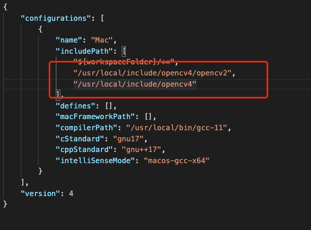

# 安装

```
brew install opencv
```



```shell
export PKG_CONFIG_PATH="/usr/local/opt/opencv@4/lib/pkgconfig:$PKG_CONFIG_PATH"
export PATH="/usr/local/opt/opencv@4/bin:$PATH"
export LDFLAGS="-L/usr/local/opt/opencv@4/lib"
export CPPFLAGS="-I/usr/local/opt/opencv@4/include"

## 编译测试程序
g++ `pkg-config opencv4 --libs --cflags opencv4` -std=c++17 ./kmeans.cpp -o ./kmeans.o
## 运行测试程序
./test.o
```

